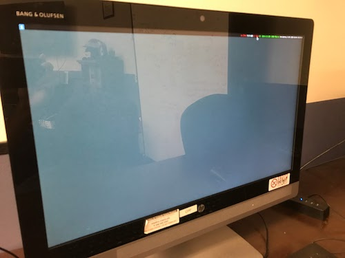

### Activate an account
If you don't already have an account with Rutgers CS, you'll need to make one to access the iLab. Your username is your university NetID. Your password can be whatever you want (does not have to be the same as your university email password).

Activate account: https://services.cs.rutgers.edu/accounts/activate/activate

Reset your password: https://services.cs.rutgers.edu/accounts/changepass/changepass


Account management info page: https://services.cs.rutgers.edu/accounts/


### Connect to iLab
There are many ways to do this. You can connect via SSH in your terminal/command prompt, or use a graphical user interface (GUI) based program like x2go or Cyberduck.

First, you need to **choose an iLab machine to connect to**. Here's a list of iLab machines: https://report.cs.rutgers.edu/nagiosnotes/iLab-machines.html

**You can choose any one that's in H248, H252, or H254 (these correspond to the rooms in Hill Center where the physical iLab machines are).** You will be able to access all your files on the iLab via any of these machines. If you ever notice you can't connect to a machine or it's super slow, you can check the site for each machine's status and pick one that's better.

An example of an iLab machine I used often was ````lisp````, which has the full hostname of ````lisp.cs.rutgers.edu````.

#### some choices of how to connect to iLab:
##### SSH (in your terminal or command prompt)
This provides no real GUI (like you can't click on file icons or see a desktop window), but you can access your files and run your programs. **[SSH guide here](using-ssh-in-terminal.md)**


##### x2go
This provides a GUI to the iLab machine. So it looks like a desktop window, with clickable file and windows. You can open up a text editor of your choice, write and save your code. You can run your programs in the terminal. Warning, x2go can be super slow/buggy. Yikes. So save your work often. **[x2go guide here](using-x2go.md)** (coming soon)


##### Cyberduck
This provides a GUI to the file explorer. You can access your files and open them up in a text editor of your choice. All of your changes will be made to the file on the iLab. However, you can't run your programs via Cyberduck, so you'll have to find another way to run your program on the iLab (for example, using SSH).
**[Cyberduck guide here](using-cyberduck.md)** (almost complete)


##### Windows Remote Desktop
tk


##### Going up to the physical machine on campus
Hill Center, Busch Campus, Rutgers—New Brunswick. There might be signs to [the CAVE](https://resources.cs.rutgers.edu/docs/rooms-equipment/cave/) or look for the Hill Annex. There are iLab machines in these rooms (all in the same hallway):

- Hill 248 (Command Center)
- Hill 252 (the CAVE)
- Hill 254 (Meltdown)

These rooms (especially the CAVE) are community hangout spots where students do HW, study, have recitations, attend club/org meetings, play video games, etc. They are maintained by iLab Assistants (also known as iLabs. I know, confusing...), who also provide walk-in tutoring for students in CS courses.

Go up to any of the computers in these rooms and log in with your iLab credentials. You're connected to an iLab machine!


> *a picture of the monitor for the cpp machine ````cpp.cs.rutgers.edu````*
