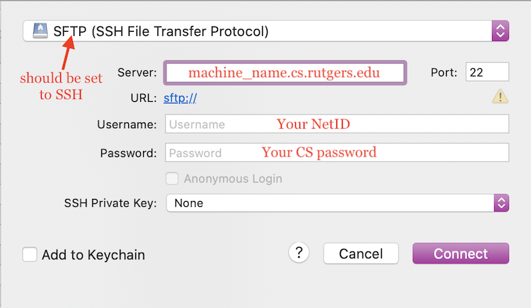

## Cyberduck

Thanks to WhiteYaksha-#0451 on the Rutgers CS Discord for their guide to setting up Cyberduck. Check it out [here](doc-files/cyberduck_tutorial.docx)!

#### Download Cyberduck
Get Cyberduck here: https://cyberduck.io/. Cyberduck is free (although it'll probably ask for a donation each time you quit the program, you are not required to donate to use it).

#### Setup and usage
Launch Cyberduck.

Open a new connection by clicking the 'Open Connection' button (top left of window). CMD-O (or whatever your OS equivalent is) also works.
> If you can't find this button, you probably need to open a Cyberduck browser window (CMD-N or whatever your OS equivalent is).

Configure the connection (image from MacOS, should be similar to other OS)

Please note that "machine_name" should be replaced by the name of the iLab machine you'd like to connect to. All iLab machines should share your saved files.

> (click [here](getting-started.md) if you have no idea what any of these things are, you'll need to activate your account for iLab or find an iLab machine)

Press 'Connect'.

If there's a window that pops up about authenticating or a fingerprint, select 'Allow' or similar.

Now, you should have essentially a file explorer window with all the directories and files on your iLab account.

**You can edit files.** Right click on a file and choose 'Edit with' to choose a text editor of your choice to edit this file with. You can also select a file and then click the 'Edit' button on the top bar. When you save edits, it should be saving to the file on the iLab servers!

**You can move files from your own computer onto the iLab.** Open up the file explorer on your own computer, select whatever file(s) you want to transfer to your iLab account, and then drag it into the Cyberduck window, into the directory you want those files in on the iLab. Cyberduck will show a popup window with the progress of the transfer(s).

**You can also download files from the iLab to your own computer.** Right click a file in the Cyberduck window and select 'Download'.

**You can also delete files from the iLab.** Like if you accidentally uploaded the wrong file, or you want to get rid of extraneous files. Right click and select 'Delete'.

**You can't really compile and run your code via Cyberduck.** You'll have to use a different method (such as SSH from terminal) in order to do that. However, Cyberduck provides an easy way to access files on the iLab, which is why it's nice.

> Set up a bookmark for the connection so you can easily connect next time! An option to do this should be in 'Bookmark' on the top bar. Then next time you can go to your bookmarks, double click the one you configured, and get connected directly.

Any questions, reach out on the Rutgers CS Discord!
